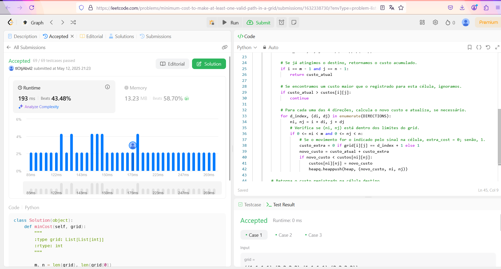

# 1368. Minimum Cost to Make at Least One Valid Path in a Grid

O arquivo [1368.py](./1368.py) apresenta a resolução do exercício número 1368 sobre grafos da plataforma LeetCode.

A resolução foi aceita pela plataforma, conforme a **Figura 1** abaixo:

**Figura 1** - Resolução da questão 1368.

## Explicação da solução
Para a solução foi utilizado o algoritmo de Dijkstra com a heap, implementado pela biblioteca heapq. 
O grid (lista de listas) é tratado como um grafo, em que cada célula é um vértice e há até quatro movimentos (para direita, esquerda, baixo e cima) a partir de cada célula.
Se o movimento realizado for o mesmo indicado pelo sinal da célula (com valores 1, 2, 3 ou 4), o custo para sair dessa célula é 0. Caso contrário, para “modificar” o sinal, o custo é 1.
O objetivo é calcular o custo mínimo para modificar os sinais de modo que exista um caminho válido começando em (0, 0) e terminando em (m–1, n–1).

1. Inicializa-se a matriz de custos com "infinito", exceto a célula inicial (0,0).

2. Os movimentos são mapeados:
   - índice 0 corresponde a sinal 1 (direita),
   - índice 1 ao sinal 2 (esquerda),
   - índice 2 ao sinal 3 (baixo) e,
   -  o índice 3, ao sinal 4 (cima).

4. Cria-se a primeira tupla do heap. A heap armazenará tuplas do tipo (custo_acumulado, i, j).
    heap = [(0, 0, 0)]

5. Cria-se um while para percorrer o heap.

6. O primeiro item do heap é retirado para processamento.

7. Se o destino final for atingindo, o custo atual é retornado.

8. Se um custo maior que o registrado para esta célula for encontrado, ignora-o, ou seja, continue.

9. Para poder identificar a direção de cada nó, cria-se um enumerate da direções. E, para cada uma das 4 direções, calcula-se o novo custo e atualiza, se necessário.

  9.1. Verifica-se se o nó observado (ni, nj) está dentro dos limites do grid.

    9.1.2 Se o movimento for o indicado pelo sinal na célula, custo_extra = 0; senão, 1.

    9.1.3 Se o novo custo for menor do que respectivo custo do nó na estrutura do novo_custo, ele é atualizado e colocado no heap.

10. O processo é repetido até o fim do heap e até que se chegue na posição final.    

**Saída:** Custo registrado na célula de destino return custos[m - 1][n - 1]
