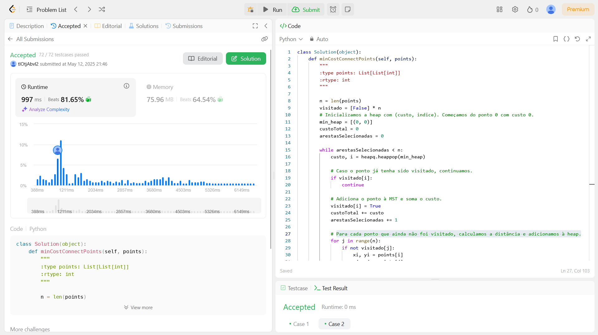

# 1584. Minimum Cost to Connect All Points

O arquivo [1584.py](./1584.py) apresenta a resolução do exercício número 1584 sobre grafos da plataforma LeetCode.

A resolução foi aceita pela plataforma, conforme a **Figura 1** abaixo:

**Figura 1** - Resolução da questão 1584.

## Explicação da solução
A proposta para solução desse problema é construir uma árvore geradora mínima (MST) em que os nós são os pontos do plano e o custo de cada aresta é a distância de Manhattan entre dois pontos.
Utilizando o algoritmo de Prim com heap, garante-se que, a cada iteração, seleciona-se a menor aresta que conecta um novo ponto à MST já construída.

1. Cria-se um lista para armazenar se os pontos já foram visitados.

2. Inicializa-se a heap com (custo, indice). Começamos do ponto 0 com custo 0.

3. Utiliza-se um while para percorrer o heap.

4. O primeiro item do heap é retirado para processamento.

5. Caso o ponto já tenha sido visitado, o while continua.

6. Adiciona o ponto à MST e soma o custo.

7. Para cada ponto que ainda não foi visitado, calcula-se a distância e adiciona-se ao heap.

10. O processo é repetido até o fim do heap e até que se chegue na posição final.

**Saída:** Custo total
