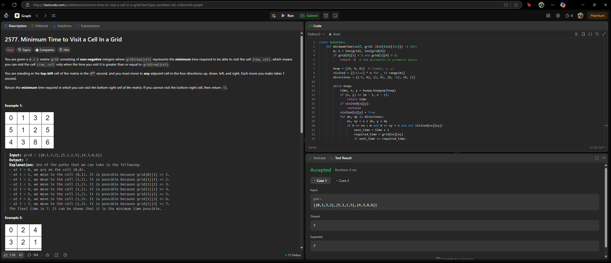

# 2577. Design Graph With Shortest Path Calculator

O arquivo [2577.py](./2577.py) apresenta a resolução do exercício número 2577 sobre grafos da plataforma LeetCode.

A resolução foi aceita pela plataforma, conforme a **Figura 1** abaixo:

**Figura 1** - Resolução da questão 2577.

## Explicação da solução

1. Começa em (0,0) no tempo t = 0.

2. Pode mover para qualquer célula adjacente em 1 segundo, mas só consegue entrar nela se o tempo atual t + 1 for maior ou igual a grid[i][j].

3. Se chegar cedo demais, precisa esperar até que o tempo seja suficiente.

    3.1. Se chegar cedo demais a uma célula com grid[i][j] > t+1, é necessário esperar o tempo necessário. Porém, se grid[i][j] - (t+1) for par, pode entrar exatamente nesse tempo. Se for ímpar, deve que esperar 1 segundo extra (movimento alternado). Atitude tomada para evitar ciclos.

4. Para evitar loops infinitos com esperas, observe a paridade do tempo

5. Usamos uma fila de prioridade (heap). Para cada célula (i,j), guardamos o menor tempo t que conseguimos chegar lá.

6. Expande os vizinhos apenas se o tempo t' = t + 1 for suficiente.

**Saída:** Tempo ao alcançar a célula (m-1,n-1). Se não foi alcançada, retorna -1.
