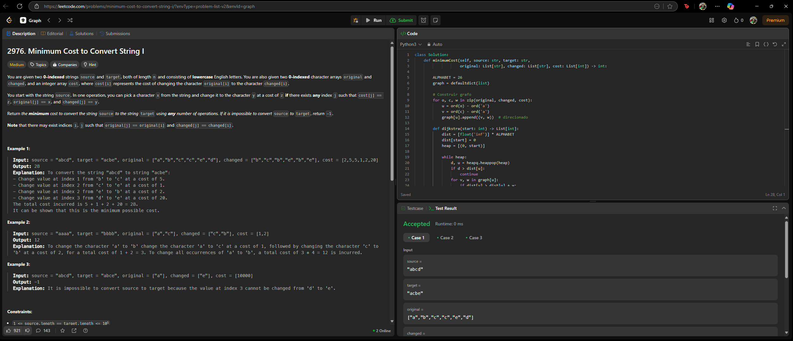

# 2976. Design Graph With Shortest Path Calculator

O arquivo [2976.py](./2976.py) apresenta a resolução do exercício número 2976 sobre grafos da plataforma LeetCode.

A resolução foi aceita pela plataforma, conforme a **Figura 1** abaixo:

**Figura 1** - Resolução da questão 2976.

## Explicação da solução

1. Problema de caminho mínimo de um nó para todos os outros em um grafo com pesos.

2. Cada caractere ('a' a 'z') é um nó no grafo.

3. As arestas representam as transformações disponíveis, com pesos definidos por cost[i].

4. Para cada par (s, t) em source e target, se s != t, usamos Dijkstra a partir de s para encontrar o menor custo para alcançar t.

5. Rodamos Dijkstra uma vez por caractere (total de 26) e guardamos os custos mínimos de conversão de x → y.

6. Não há necessidade de conectar todos os nós entre si — apenas garantir caminhos mínimos de source[i] → target[i].

**Saída:** Custo mínimo total final.
